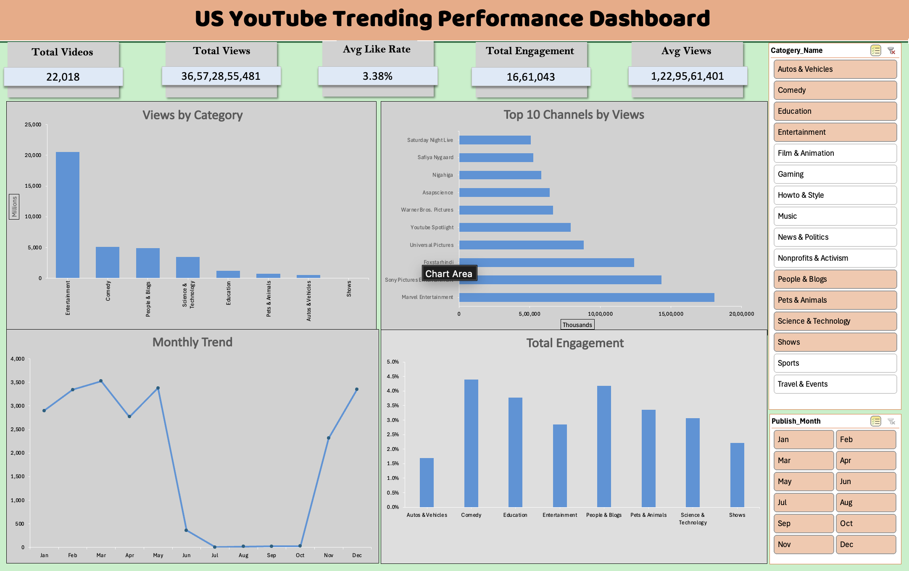

# US-Youtube-Trending-Performance
# 📊 US YouTube Trending Performance Dashboard (Excel)

## 📌 Overview
Interactive Excel dashboard analyzing US YouTube trending video performance using views, likes, comments, and category-wise insights.

## 🛠 Tools Used
- Microsoft Excel
- Pivot Tables & Pivot Charts
- Slicers
- KPI Cards
- Data Cleaning

## 📊 KPIs
- Total Videos
- Total Views
- Average Like Rate
- Total Engagement
- Average Views

## 📈 Key Insights

- Entertainment category generated the highest total views among all categories.
- Comedy category recorded the highest average like rate (~4.4%), indicating strong engagement.
- March showed peak trending activity compared to other months.
- Marvel Entertainment ranked as the top channel by total views.
- Engagement rate varies significantly across categories, with Autos & Vehicles having the lowest.

  
## 🖼 Dashboard Preview

## 🔎 Pivot / Analysis

> Note: Excel file not uploaded due to file size limitations. Screenshots are provided for demonstration.
